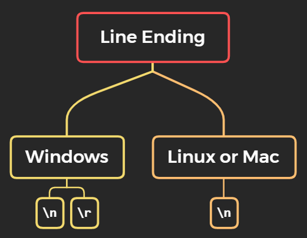

# پیکربندی گیت (Git config)

گیت یک دستور به نام **git config** دارد که به شما اجازه می‌دهد متغیرهای پیکربندی را که تمام جنبه‌های ظاهر و عملکرد گیت را کنترل می‌کنند، دریافت یا تنظیم کنید.

مواردی که باید هنگام نصب اولیه گیت مشخص کنیم:
- **نام**
- **ایمیل**
- **ویرایشگر پیش‌فرض**
- **پایان خط (Line Ending)**

## سطوح پیکربندی گیت
دستور git config می‌تواند آرگومان‌هایی برای تعیین سطح پیکربندی دریافت کند. سطوح پیکربندی زیر در git config وجود دارد:

<p align="center">

</p>

### **سیستمی (System)** :
پیکربندی سطح سیستمی در کل سیستم اعمال می‌شود. کل سیستم یعنی همه کاربران یک سیستم‌عامل و همه مخازن. فایل پیکربندی سطح سیستمی در فایلی به نام **gitconfig** در دایرکتوری سیستم ذخیره می‌شود. **$(prefix)/etc/gitconfig** در سیستم‌های UNIX و **C:\ProgramData\Git\config** در ویندوز.

### **سراسری (Global)** :
پیکربندی سطح سراسری مخصوص هر کاربر است. یعنی فقط برای یک کاربر سیستم‌عامل اعمال می‌شود. مقادیر پیکربندی سراسری در دایرکتوری خانگی کاربر ذخیره می‌شود. **~/.gitconfig** در UNIX و **C:\Users\\.gitconfig** در ویندوز.

### **محلی (Local)** :
این سطح پیش‌فرض در گیت است. اگر گزینه‌ای برای سطح پیکربندی مشخص نشود، git config به صورت محلی مقداردهی می‌کند. مقادیر پیکربندی محلی در دایرکتوری **.git/config** هر مخزن ذخیره می‌شود.

## تنظیم مقادیر پیکربندی:

**تنظیم نام کاربری**
نام کاربری توسط گیت برای هر commit استفاده می‌شود.
```
$ git config --global user.name "Agan Ganji"
```

**تنظیم ایمیل**
گیت این ایمیل را برای هر commit استفاده می‌کند.
```
$ git config --global user.email "agan7060@gmail.com"
```

**تنظیم ویرایشگر**
می‌توانید ویرایشگر متنی پیش‌فرض را زمانی که گیت نیاز دارد پیامی وارد کنید، تنظیم کنید. اگر ویرایشگری انتخاب نکرده باشید، گیت از ویرایشگر پیش‌فرض سیستم شما استفاده می‌کند.

برای انتخاب ویرایشگر دیگر مانند Vim:
```
$ git config --global core.editor Vim
```

**بررسی تنظیمات**
```
$ git config --list
```
یا در ویرایشگرها از این دستور استفاده کنید:
```
$ git config --global -e
```

## پایان خط (Line Ending)

<p align="center">

</p>

**`\n` : خط جدید (line feed)**  
**`\r` : بازگشت به ابتدای خط (carriage return)**

برای رفع مشکل پایان خط باید مقدار **`core.autocrlf`** را در git config تنظیم کنیم.

اگر روی ویندوز هستید:
```
$ git config --global core.autocrlf true
```

اگر روی لینوکس یا مک هستید:
```
$ git config --