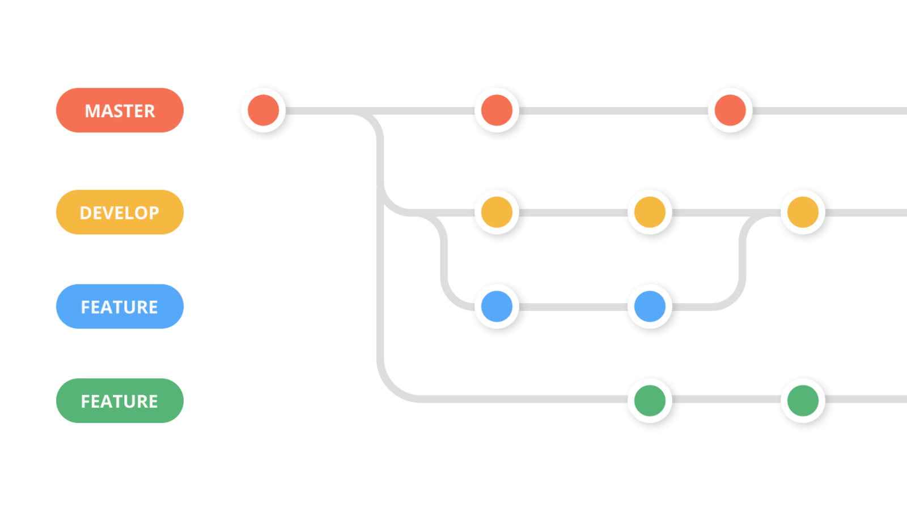

# شاخه‌بندی و ادغام (Branching and merging)

یک شاخه (branch) نسخه‌ای از مخزن است که از پروژه اصلی جدا می‌شود. این قابلیت در اکثر سیستم‌های کنترل نسخه مدرن وجود دارد. یک پروژه گیت می‌تواند بیش از یک شاخه داشته باشد. شاخه‌ها اشاره‌گری به یک اسنپ‌شات از تغییرات شما هستند. وقتی می‌خواهید یک ویژگی جدید اضافه کنید یا باگی را رفع کنید، یک شاخه جدید ایجاد می‌کنید تا تغییرات خود را روی آن انجام دهید. این کار باعث می‌شود کد ناپایدار با کد اصلی ادغام نشود و همچنین به شما کمک می‌کند تاریخچه آینده پروژه را قبل از ادغام با شاخه اصلی مرتب کنید.




## مشاهده لیست شاخه‌ها (list branch)

با استفاده از دستورات `$ git branch` یا `$ git branch --list` می‌توانید همه شاخه‌های پروژه را مشاهده کنید.

## ایجاد شاخه جدید (create a new branch)

برای ساخت یک شاخه جدید و کار روی آن، از دستور زیر استفاده کنید:
```bash
$ git branch <name>
```

## جابجایی بین شاخه‌ها (checkout vs switch)

برای جابجایی بین دو شاخه می‌توانید از دستور **git checkout** استفاده کنید:
```bash
$ git checkout <branch name>
```
اما این روش کلی است و بهتر است از دستور `switch` به شکل زیر استفاده کنید:
```bash
$ git switch <name>
```

## تغییر نام شاخه (rename branch)

برای تغییر نام شاخه با کمک دستور **git branch** می‌توانید از دستور زیر استفاده کنید:
```bash
$ git branch -m <old name> <new name>
```

## حذف شاخه (delete branch)

می‌توانید شاخه مورد نظر را حذف کنید. این عملیات ایمن است و اگر شاخه تغییرات ادغام‌نشده داشته باشد، گیت اجازه حذف نمی‌دهد:
```bash
$ git branch -d <name>
```

## ادغام شاخه‌ها (merge)

گیت به شما اجازه می‌دهد شاخه دیگری را با شاخه فعال فعلی ادغام کنید. برای ادغام دو شاخه از دستور زیر استفاده کنید:
```bash