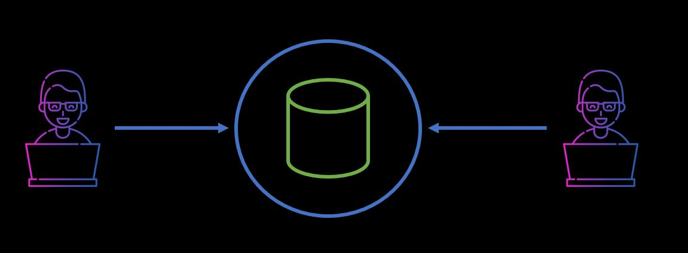
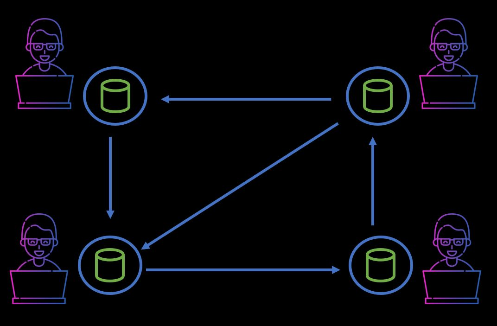
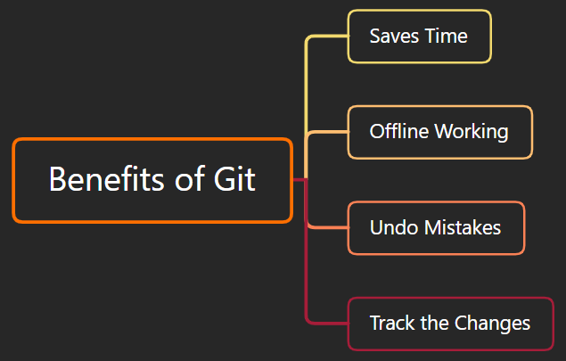

<div dir="rtl">

# گیت (Git)

## گیت چیست؟
گیت یک <span dir="ltr">distributed version control system</span> (سیستم کنترل نسخه توزیع‌شده) در جهان است.
این سیستم برای مدیریت پروژه‌ها با سرعت و کارایی بالا توسعه یافته است.
گیت به ما اجازه می‌دهد تا به همراه اعضای تیم خود روی یک پروژه و در یک فضای کاری مشترک کار کنیم.

## سیستم کنترل نسخه چیست؟
- سیستم کنترل نسخه نرم‌افزاری است که تغییرات یک فایل یا مجموعه‌ای از فایل‌ها را در طول زمان دنبال می‌کند تا بتوانید نسخه‌های خاصی را بعداً بازیابی کنید. همچنین به شما اجازه می‌دهد با سایر برنامه‌نویسان همکاری کنید.
- سیستم کنترل نسخه مجموعه‌ای از ابزارهای نرم‌افزاری است که به یک تیم کمک می‌کند تا تغییرات در کد منبع را مدیریت کند. این سیستم از یک نوع پایگاه داده ویژه برای پیگیری هر تغییر در کد استفاده می‌کند.
- توسعه‌دهندگان می‌توانند نسخه‌های قبلی کد را با نسخه‌های قدیمی‌تر مقایسه کنند تا اشتباهات را برطرف کنند.

### بدون سیستم کنترل نسخه (VCS)

<p align="center">

</p>

### انواع سیستم کنترل نسخه (VCS)

<p align="center">

</p>

- <span dir="ltr">Centralized</span> :
<p align="center">

</p>

- <span dir="ltr">Distributed</span> :
<p align="center">

</p>

## ویژگی‌های گیت

-   متن‌باز (<span dir="ltr">Open Source</span>)
-   مقیاس‌پذیر (<span dir="ltr">Scalable</span>)
-   توزیع‌شده (<span dir="ltr">Distributed</span>)
-   امنیت (<span dir="ltr">Security</span>)
-   سرعت (<span dir="ltr">Speed</span>)
-   پشتیبانی از توسعه غیرخطی (<span dir="ltr">Supports non-linear development</span>)

## مزایای استفاده از گیت

<p align="center">

</p>

## استفاده از گیت

- <span dir="ltr">Command line</span>
- ویرایشگرهای کد و محیط‌های توسعه (<span dir="ltr">Code Editors and IDEs</span>)
- رابط گرافیکی (<span dir="ltr">GUI</span>)

## نصب گیت

برای استفاده از گیت باید آن را روی رایانه خود نصب کنید. حتی اگر قبلاً گیت را نصب کرده‌اید، بهتر است آن را به آخرین نسخه به‌روزرسانی کنید. می‌توانید آن را به صورت یک بسته یا از طریق نصب‌کننده‌های دیگر یا از سایت رسمی آن دانلود و نصب کنید.

#### نسخه گیت
</div>

```
$ git --version
```