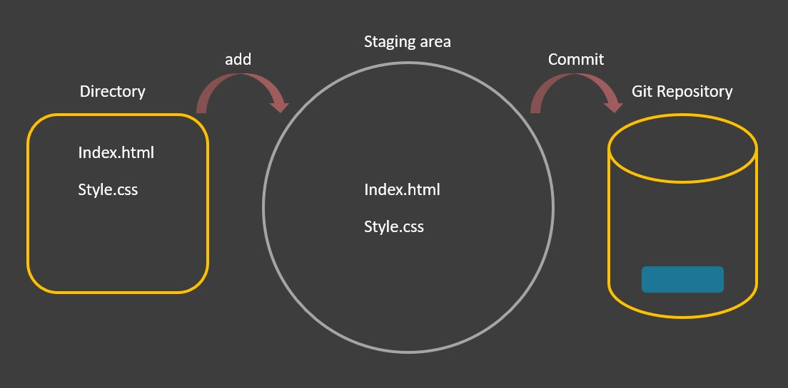

**در این جلسه یاد می‌گیریم:**
 - git add
 - git commit
 - رد شدن از مرحله Staging
 - حذف فایل‌ها
 - تغییر نام فایل‌ها

## git add
دستور git add برای اضافه کردن محتوای فایل‌ها به Staging Area استفاده می‌شود. این دستور محتوای فعلی working tree را به staging area منتقل می‌کند و آن را برای commit بعدی آماده می‌سازد. هر بار که فایلی را اضافه یا به‌روزرسانی می‌کنیم، باید تغییرات را به staging area منتقل کنیم.
```bash
$ git add file1.txt file2.txt
```
یا
```bash
$ git add *.txt
```
یا
```bash
$ git add .
```

<p align="center">

</p>

## git commit
این دستور برای ثبت تغییرات در مخزن استفاده می‌شود. git commit بعد از [git add](https://www.javatpoint.com/git-add) اجرا می‌شود. هر commit شامل داده‌های index و پیام commit است. هر commit یک رابطه والد-فرزندی ایجاد می‌کند. وقتی فایلی را به git اضافه می‌کنیم، ابتدا وارد staging area می‌شود. دستور commit برای انتقال تغییرات از staging area به مخزن استفاده می‌شود.
`git config --global core.editor "code --wait"`

برای پیام کوتاه:
```bash
$ git commit -m "message"
```

برای پیام کامل:
```bash
$ git commit
```
بعد از این دستور، `VS Code` باز می‌شود و می‌توانید پیام خود را بنویسید.
در `VS Code` باید پیام را در دو بخش وارد کنید:
1. توضیح کوتاه
2. توضیح بلند

## رد شدن از مرحله Staging
برای این کار:
```bash
$ git commit -a -m "message"
```
یا
```bash
$ git commit -am "message"
```

## حذف فایل‌ها
```bash
rm file.txt
```
بعد از این باید فایل `file.txt` را به staging area ببرید و سپس commit کنید.
برای دیدن فایل‌های موجود در staging area از این دستور استفاده کنید:
```bash
$ git ls-files
```
اما می‌توانید بدون انتقال فایل به staging area از دستور زیر استفاده کنید:
```bash
$ git rm file.txt
```

## تغییر نام فایل‌ها

برای تغییر نام فایل‌ها در یونیکس از دستور move استفاده کنید:
```bash
mv file.txt index.html
```
حالا دو فایل را به staging area اضافه می‌کنیم:
```bash
$ git add file.txt index.html
```
سپس commit می‌کنیم.
اما git راه بهتری ارائه می‌دهد:
```bash
$ git mv file.txt index.html
```
با این روش نیازی به استفاده از دستور `add` برای انتقال فایل به staging area نیست و می‌توانید راحت‌تر commit